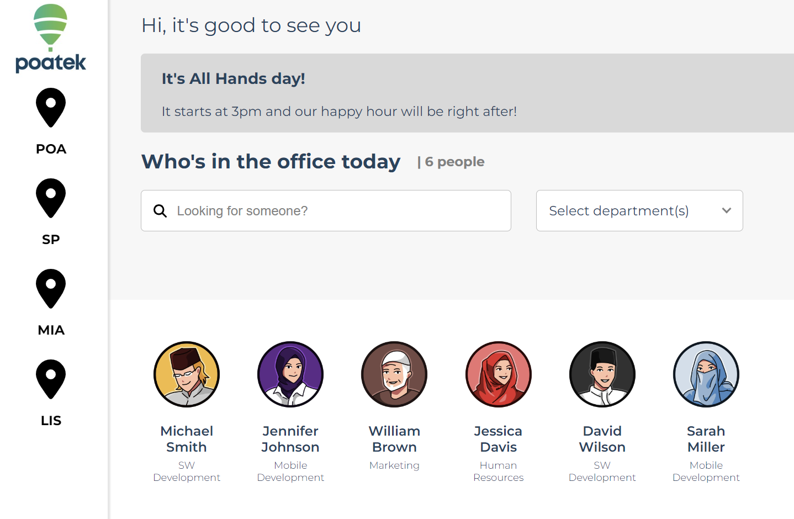

<details>
  <summary>Table of Contents</summary>
  <ol>
    <li>
      <a href="#about-the-project">About The Project</a>
      <ul>
        <li><a href="#built-with">Built With</a></li>
      </ul>
    </li>
    <li>
      <a href="#getting-started">Getting Started</a>
      <ul>
        <li><a href="#prerequisites">Prerequisites</a></li>
        <li><a href="#installation">Installation</a></li>
      </ul>
    </li>
    <li><a href="#usage">Usage</a></li>
    <li><a href="#roadmap">Roadmap</a></li>
    <li><a href="#contributing">Contributing</a></li>
    <li><a href="#license">License</a></li>
    <li><a href="#contact">Contact</a></li>
    <li><a href="#acknowledgments">Acknowledgments</a></li>
  </ol>
</details>

<!-- ABOUT THE PROJECT -->
## About The Project

[](https://client-project-5de94.web.app/)

OnSite is an app created for Poatek, an IT consulting firm based in Brasil that operates on a hybrid work model, to quickly plan their meetings based on where employees are working for the day. 

<p align="right">(<a href="#readme-top">back to top</a>)</p>

### Built With

* React
  [](https://client-project-5de94.web.app/)


[//]: # ([![React]&#40;src/assets/pics/react.png&#41;]&#40;https://reactjs.org/&#41;)
<p align="right">(<a href="#readme-top">back to top</a>)</p>

<!-- GETTING STARTED -->
## Getting Started

This is an example of how you may give instructions on setting up your project locally.
To get a local copy up and running follow these simple example steps.

### Prerequisites

This is an example of how to list things you need to use the software and how to install them.
* npm
  ```sh
  npm install npm@latest -g
  ```

### Installation

_Below is an example of how you can instruct your audience on installing and setting up your app. This template doesn't rely on any external dependencies or services._

1. Clone the repo
   ```sh
   git clone https://github.com/cs394-s23/OnSite.git
   ```
2. Install NPM packages
   ```sh
   npm install
   ```
3. Enter your API in `config.js`
   ```js
   const API_KEY = 'ENTER YOUR API';
   ```
   
4. Run the app
   ```sh
   npm start
   ```

<p align="right">(<a href="#readme-top">back to top</a>)</p>


### Testing
All the testing files are under src with a .test.js postfix. You can 
run the test by running the following command in the terminal:
```sh
npm test
```